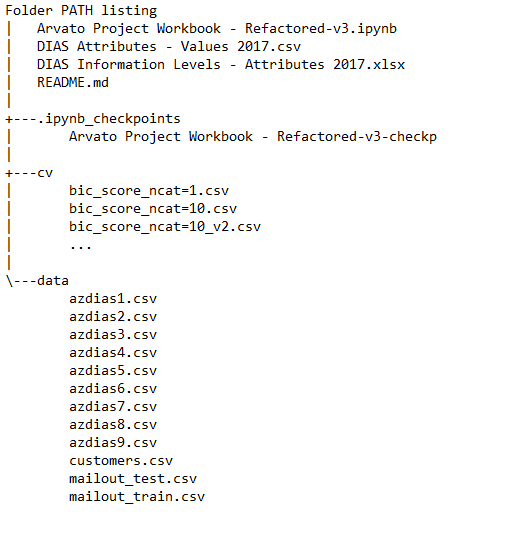

# Arvato Financial Project: Customer Segmentation and Response Prediction

### Summary of Project
The project (1) segments customers of client Arvato Financial and derive key statistical features of each cluster, (2) compares the representation of each cluster in customers and in the general population, to derive a likelihood of each group in becoming a customer, (3) predicts whether a new customer can respond to the company's mail-out campaign, and (4) derives important features of the customer that contributes to a higher chance of reply.

### Libraries Used:
- Numpy, pandas
- matplotlib
- datetime, math, time, random
- scipy.stats, statistics
- sklearn
- [lightgbm](https://lightgbm.readthedocs.io/en/latest/)
- [catboost](https://catboost.ai/)
- [SHAP](https://github.com/slundberg/shap)
- [imblearn](https://imbalanced-learn.readthedocs.io/en/stable/api.html)

### Files in the repository

<b> </b>

The files in the repository include:
- Code in Jupyter notebook: 'Arvato Project Workbook - Refactored-v3' file contains all script to run the analysis in this project.
- README.md - this file
- cv folder - this folder contains output scores for clustering performance
- data - this folder contains dataset for customers and population (azdiasX.csv files), as well as training and testing dataset to predict mailout campaign response
Note that data are not pushed to GitHub as it is proprietary.

### Motivation of Project
The client Arvato Financial provides a suite of services to its customers such as fraud detection and credit management. Understanding characteristics of its customers is key to serving customer needs, increasing customer retention and empowering customer acquisition. Understanding how customers respond to a mail-out campaign, one of the most relevant channels of marketing, allows the company to concentrate its resources and target those with best chance of responding to the campaign. In light of this, Arvato Financial challenged us with two tasks: (1) to segment its customers and better understand the customer profiles and (2) to predict which customers have better chance of responding to the company's mail-out campaigns.

### Summary of Results
Detailed technical description is provided in this [Medium](https://medium.com/@rh9/customer-segmentation-and-campaign-response-prediction-for-arvato-financial-49e0e2bfc631) article.

#### Customer Segmentation
Before proceeding, we note that there exist a MAIN-CLUSTER, where samples don't have many missing attributes and SUB-CLUSTER, where samples have lots of missing attributes. These two clusters may come from different data collection process and are analyzed in parallel in this project.

To perform customer segmentation, we use KMeans method to cluster customers. The data processing pipeline parameters are tuned such that one can achieve a fairly robust clustering result with 3 clusters in the MAIN-CLUSTER and 5 clusters in the SUB-CLUSTER. Four metrics were recorded to justify robustness of our algorithm. To interpret the segmented customers, we then use inverse-transform and scaling to derive typical customer profiles within each cluster. We then use the 'fitted' data processing pipeline and clustering algorithm to process the population dataset. The ratio of cluster fractions within customers vs population is taken, in order to identify which group is more likely than average to become a customer.

It is found that the 3 clusters in the MAIN-CLUSTER differ most in terms of level and recency of transaction activity in a few purchase categories such as banking, telecommunications, mail-order and the entire pool of purchases. The customer clusters more likely to become a customer show a higher level of transaction activity. This is in line with our intuition that recent purchase behaviors signal more engagement with financial service providers and possibly our client Arvato Financial. These two customer segments also have more potential to use client's services more and bring more revenue to the client.

The dominant cluster in the SUB-CLUSTER, however, have low level of transaction activity and are typically average to high-income minimalists. Still, it turns out this dominant cluster in the SUB-CLUSTER has higher likelihood to become a customer than an average person. This is potentially due to the fact that customers in this segment are higher-income; in addition, though they are financial minimalists, they are more enthusiastic to advertising.

#### Mail-out Response Prediction
First, we benchmark the performance of different classification algorithms and found the Gradient Boosting Classifier performs best. Then we go on to optimize both the data processing pipeline parameters and hyper-parameters of the algorithm itself to better increase our prediction power. The metric chosen is the AUC-ROC, which works fairly well with imbalanced datasets. The performance of the algorithm is trained on a training dataset and evaluated on a test dataset.We then tried upsampling and feature selection to improve performance. The gradient boosting algorithm trained with the top 380 features turn out to be my best algorithm.

I was able to place in the the Kaggle competition in about top 12% of all entries, with AUC-ROC score at 0.80456, which is only ~0.006 away from 2nd place on the leaderboard.

Some important features are identified that contribute to higher chance of response. These include:
- Multiple buyer activity in segments of SOZIALES, LOTTO
- low buyer activity in BUCH_CD segment
- higher ownership of Ford/Opel cars and higher ownership of European cars in the community
- age older than 80 years of smaller than about 25 years

These attributes are rather un-intuitive, which suggests the model is able to uncover some hidden drivers of response rate.

### Acknowledgements

- The Udacity Data Science Nano-Degree Team
- [Article on interpretable machine learning for trees](https://towardsdatascience.com/interpretable-machine-learning-with-xgboost-9ec80d148d27)
